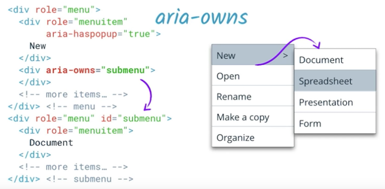

project_path: /web/_project.yaml
book_path: /web/fundamentals/_book.yaml
description: Using ARIA relationship attributes

{# wf_review_required #}
{# wf_updated_on: 2016-02-29 #}
{# wf_published_on: 2016-02-29 #}

# ARIA Relationships {: .page-title }




Earlier we discussed `aria-labelledby`, which is an example of a *relationship attribute*. A relationship attribute creates a semantic relationship between elements on the page regardless of their DOM relationship. In the case of `aria-labelledby`, that relationship is "this element is labelled by that element".

The ARIA specification lists <a href="https://www.w3.org/TR/wai-aria/states_and_properties#attrs_relationships" target="_blank">eight relationship attributes</a>. Six of these, `aria-activedescendant`, `aria-controls`, `aria-describedby`, `aria-flowto`, `aria-labelledby`, and `aria-owns`, take a reference to one or more elements to create a new link between elements on the page. The difference in each case is what that link means and how it is presented to users.

`aria-owns` is one of the most widely used ARIA relationships. This attribute allows us to tell assistive technology that an element that is separate in the DOM should be treated as a child of the current element, or to rearrange existing child elements into a different order. For example, if a pop-up sub-menu is visually positioned near its parent menu, but cannot be a DOM child of its parent because it would affect the visual presentation, you can use `aria-owns` to present the sub-menu as a child of the parent menu to a screen reader.

`aria-activedescendant` plays a related role. Just as the active element of a page is the one that has focus, setting the active descendant of an element allows us to tell assistive technology that an element should be presented to the user as the focused element when its parent actually has the focus. For example, in a listbox, you might want to leave page focus on the listbox container, but keep its `aria-activedescendant` attribute updated to the currently selected list item. This makes the currently selected item appear to assistive technology as if it is the focused item.

`aria-controls` and `aria-flowto` provide more "advisory only" relationships. `aria-controls` can provide a hint to the user that a particular element controls another part of the page, such as a sorting button on a column of data. And `aria-flowto` provides a user with one or more alternate "next elements" that they can optionally navigate to and from, such as a footnote or a selection of options in a flow chart.

`aria-describedby` provides an accessible description in the same way that `aria-labelledby` provides a label. Like `aria-labelledby`, `aria-describedby` may reference elements that are otherwise not visible, whether hidden from the DOM, or hidden from assistive technology users. This is a useful technique when there is some extra explanatory text that a user might need, whether it applies only to users of assistive technology or all users. 

A common example is a password input field that is accompanied by some descriptive text explaining the mimimum password requirements. Unlike a label, this description may or may not ever be presented to the user; they may have a choice of whether to access it, or it may come after all the other information, or it may be pre-empted by something else. For example, if the user is entering information, their input will be echoed back and may interrupt the element's description. Thus, a description is a great way to communicate supplementary, but not essential, information; it won't get in the way of more critical information such as the element's role.

The remaining relationship attributes are a little different, and work together. `aria-posinset` ("position in set") and `aria-setsize` ("size of set") are about defining a relationship between sibling elements in a set, such as a list. 

When the size of a set cannot be determined by the elements present in the DOM &mdash; such as when lazy rendering is used to avoid having all of a large list in the DOM at once &mdash; `aria-setsize` can specify the actual set size, and `aria-posinset` can specify the element's position in the set. For example, in a set that might contain 1000 elements, you could say that a particular element has an `aria-posinset` of 857 even though it appears first in the DOM, and then use dynamic HTML techniques to ensure that the user can explore the full list on demand.
